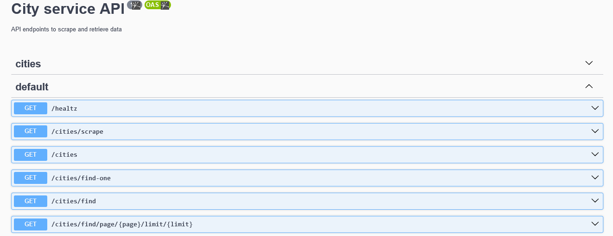
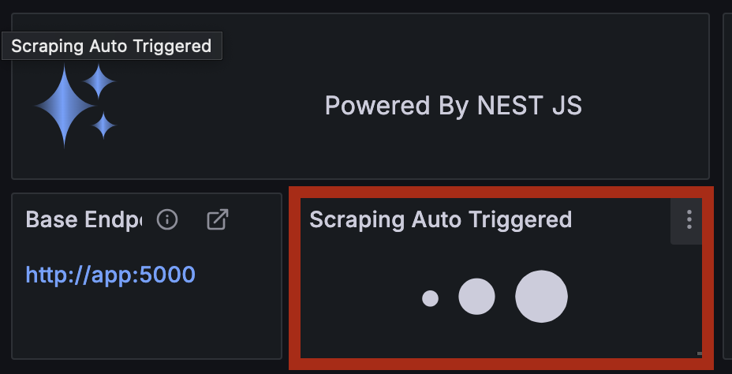

# City Scraping challenge

This service contains a **Nest JS** App which is used to:

- scrape data from [Agenzia delle entrate](https://geoportale.cartografia.agenziaentrate.gov.it/age-inspire/srv/ita/catalog.search#/home?pg=) website
- save scraped data into DB
- get data from DB

# Configuration

This section is on **How to run the app**

## Development

**Prerequisites**

- Docker / Docker compose
- node (`>= v21.7.3`)
- yarn (`>= 1.22.22`)

Install dependecies with `yarn install` (needed since the node_modules are synced from local dir).

Now run and wait for the service to be up and running:

```bash
docker compose -f docker-compose.yaml up --build`
```

You can now visit [mongo-express](http://127.0.0.1:8081)

## UI APP

**Prerequisites**

- Docker / Docker compose

The following instructions will start the service by creating 3 containers using docker compose:

- App: [Nest JS](https://nestjs.com/) Application
- Mongo: Database
- UI: powered by [Grafana](https://grafana.com/)

To run the app run the command

```bash
docker compose -f compose-app.yaml up -d
```

Now wait for the app to be up & running.

After a while you will be able to visit the [dashboard](http://localhost:3000/d/ddkm4hx60jvuod/italy-cities?orgId=1) and see something like:


If it is the first time you run the app, your database is not populated yet and you will not see any data. However the dashboard triggers the scrapeing job and you will be able to see data by refreshing the page (*Note that auto refresh is disabled*).

At the top of the dashboard you can apply filters to the query.

# API DOC

Swagger doc is available at `docs/api` endpoint. Run the app and visit http://localhost:5000/docs/cities to see it:



## Scraping

The scraping process is powered by [puppeteer](https://pptr.dev/).

The `scrape` operation can be triggered by calling the `cities/scrape` endpoint and it can take few minutes to finish (up to 7 minutes).

To manually trigger the process you can make an http call to the service by running `curl -X GET http://localhost:5000/cities/scrape`, however if you are using the grafana dashboard, it will be automatically triggered by the scrape panel:



Note that if the scraping process is already running, the server answer with status `400` and with a message: `"message":"scraping job already running"`.